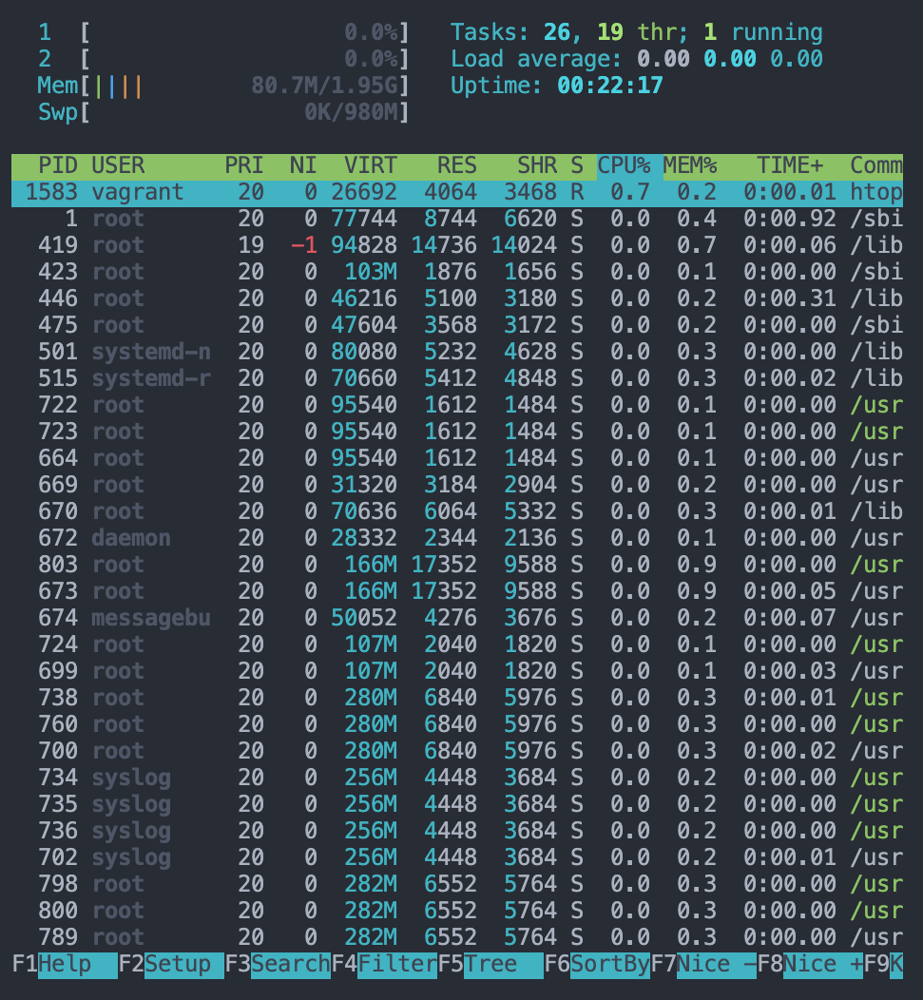

# 「試して理解 Linux のしくみ」実験用リポジトリ

## 各種リンク

- 書籍サイト
  - [試して理解 Linux のしくみ - 実験と図解で学ぶ OS とハードウェアの基礎知識](http://gihyo.jp/book/2018/978-4-7741-9607-7)（技術評論者，2018）
- リポジトリ
  - [satoru-takeuchi/linux-in-practice](https://github.com/satoru-takeuchi/linux-in-practice)

## 実行環境

Vagrant で構築した Ubuntu の仮想環境上でサンプルコードを実行した．

- ホスト OS：macOS Mojave 10.15.3
- ゲスト OS：Ubuntu 18.04.4 LTS (GNU/Linux 4.15.0-76-generic x86_64)
- Vagrant 2.2.7
- VirtualBox v6.1.2

書籍の「はじめに」では，**挙動が変わるために仮想マシン（VM）上ではなく実機上で Ubuntu を動作させることを推奨している**が，Ubuntu 用の実機がないので VM で妥協した．また，検証環境としては，Docker コンテナよりは VM が良いと判断した．

## Vagrant で環境構築

- VM の起動
  - `vagrant up` したディレクトリが VM の `/vagrant` 配下にマウントされる．

```sh
$ git clone [repo-url]
$ cd [my-repo]
$ vagrant init bento/ubuntu-18.04
$ vagrant plugin install vagrant-disksize  # ディスク容量を設定するためのプラグイン
$ vagrant up
# ログの最後らへんにマウントに関するログが出力されている
# ==> default: Mounting shared folders...
#    default: /vagrant => /Users/pyteyon/Projects/basics/OS/Linux/Linux-no-sikumi
```

- VM 環境に入り，マウントの確認

```sh
# ローカル環境
$ vagrant status  # VM が起動中であることを認確
$ vagrant ssh

# VM 環境
vagrant@vagrant:~$ cd /vagrant
vagrant@vagrant:/vagrant$ ls
install.sh  Makefile  note  README.md  sample-code  src  Vagrantfile
# マウントされてる
```

- VM 環境に入り，実験に必要なパッケージのインストール
  - インストールスクリプトをあらかじめ書いておいた．

```sh
# ローカル環境
$ vagrant ssh

# VM 環境
vagrant@vagrant:~$ cd /vagrant
vagrant@vagrant:~$ sh install.sh
```

- VM の停止

```sh
$ vagrant halt
```

## VM のスペック

`Vagrantfile` でマシンスペックの設定が行える．ディスクサイズのように一部プラグインが必要な部分もある．

- [HashiCorp: Vagrant - Configuration](https://www.vagrantup.com/docs/providers/virtualbox/configuration)

### 全体

- CPU
  - Intel(R) i9-9880H 2.30GHz
  - 物理プロセッサ数：1（ハイパースレッディング on）
  - コア数：2
- RAM
  - 2 GB
- DISK
  - 100 GB

### CPU，メモリの確認

サーバ監視用の `htop` コマンドで簡単にサーバの CPU のコア数とメモリ容量が確認できる．

```sh
# VM 環境
$ htop
```

- htop 実行時の様子



### CPU の確認：物理プロセッサ数，コア数

CPU の[ハイパースレッディング](http://e-words.jp/w/%E3%83%8F%E3%82%A4%E3%83%91%E3%83%BC%E3%82%B9%E3%83%AC%E3%83%83%E3%83%87%E3%82%A3%E3%83%B3%E3%82%B0.html#:~:text=%E3%83%8F%E3%82%A4%E3%83%91%E3%83%BC%E3%82%B9%E3%83%AC%E3%83%83%E3%83%87%E3%82%A3%E3%83%B3%E3%82%B0%E3%81%A8%E3%81%AF%E3%80%81%E7%B1%B3,%E4%BA%8C%E3%81%A4%E3%81%AB%E8%A6%8B%E3%81%9B%E3%81%8B%E3%81%91%E3%82%8B%E6%8A%80%E8%A1%93%E3%80%82)が on の場合，物理プロセッサ数と OS が認識するプロセッサ数（コア数）が合わないので注意．

```sh
# VM 環境
# ハードウェアの確認
$ sudo lshw | grep -i cpu
     *-cpu
          product: Intel(R) Core(TM) i9-9880H CPU @ 2.30GHz
          bus info: cpu@0
          capabilities: fpu fpu_exception wp vme de pse tsc msr pae mce cx8 apic sep mtrr pge mca cmov pat pse36 clflush mmx fxsr sse sse2 ht syscall nx rdtscp x86-64 constant_tsc rep_good nopl xtopology nonstop_tsc cpuid tsc_known_freq pni pclmulqdq ssse3 cx16 pcid sse4_1 sse4_2 x2apic movbe popcnt aes xsave avx rdrand hypervisor lahf_lm abm 3dnowprefetch invpcid_single pti fsgsbase avx2 invpcid rdseed clflushopt md_clear flush_l1d arch_capabilities
# 物理プロセッサ数：id が 1 種類のため 1 個
$ cat /proc/cpuinfo | grep "physical id"
physical id     : 0
physical id     : 0
# 仮想プロセッサ数：OS 側が何個の CPU を認識しているか確認する：2 つの CPU を認識している
$ cat /proc/cpuinfo | grep processor
processor       : 0
processor       : 1
# コア数：仮想プロセッサ数の結果と一致するはず
vagrant@vagrant:~$ cat /proc/cpuinfo | grep "cpu cores"
cpu cores       : 2
cpu cores       : 2
```

- 参考
  - [Linux で CPU のコア数と物理プロセッサ数を確認する方法](http://www.lesstep.jp/step_on_board/linux/137/)
